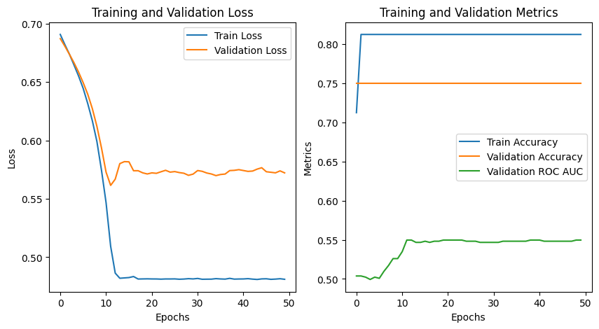
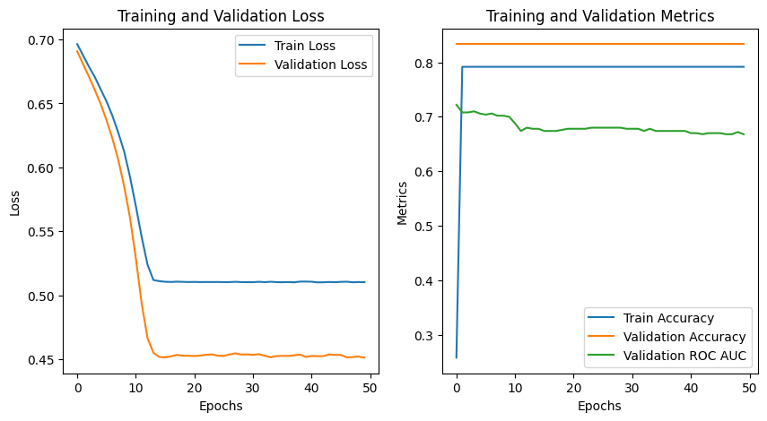
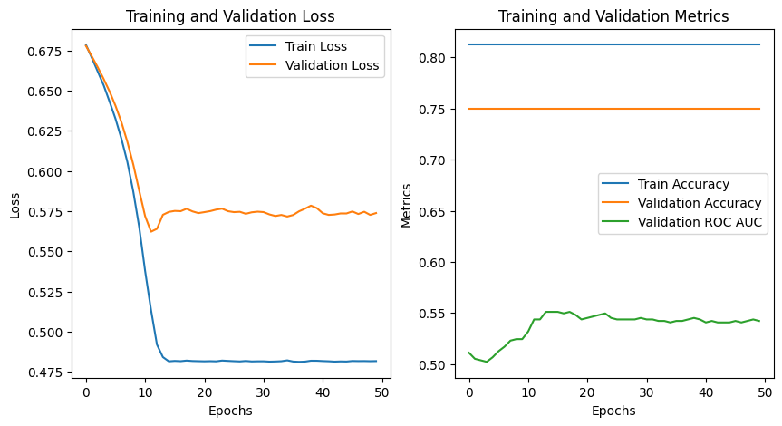
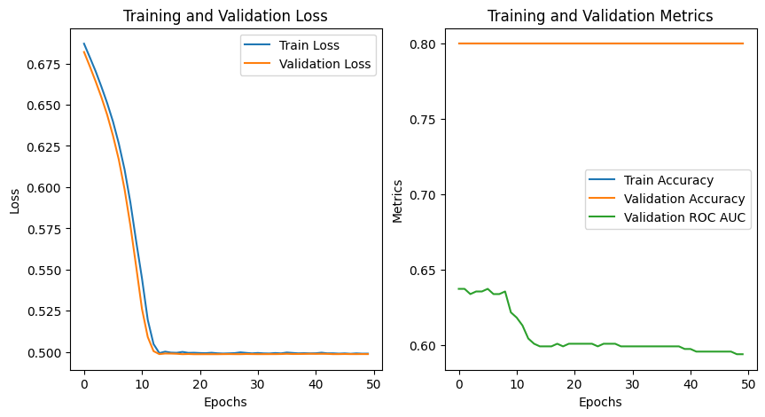
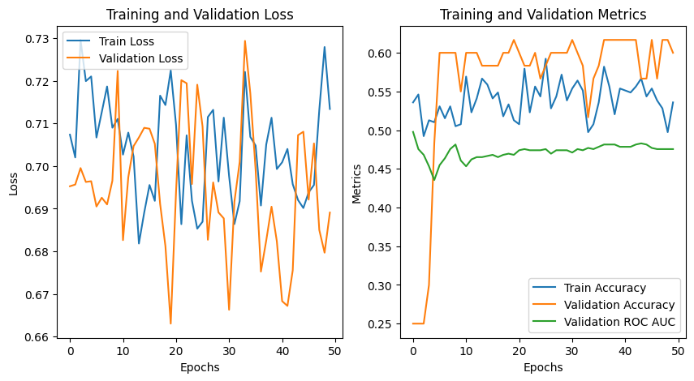
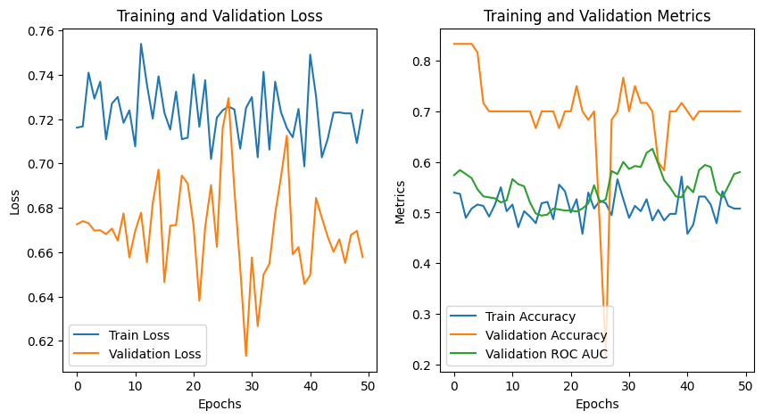

# Genotype-Phenotype Prediction Project

This project focuses on analyzing genotype and phenotype data and using various machine learning and deep learning models to predict phenotypic traits based on genetic information. The key challenge addressed in this project is handling imbalanced data and optimizing prediction performance for both continuous and binary phenotype datasets.

## Project Overview

- **Genotype Data**: Used as independent variables.
- **Phenotype Data**: Used as dependent (response) variables.
  - Continuous phenotype data was used for regression models.
  - Binary phenotype data was used for classification models, including deep learning models such as CNN and RNN.
- **Main Objective**: Predict phenotypic traits based on genetic data and evaluate model performance using appropriate metrics, with a focus on addressing data imbalance.

## Key Challenges

- **Data Imbalance**: The phenotype binary dataset has a class imbalance ratio of 4:1, which significantly affects the model's ability to learn effectively.
- **Evaluation Metrics**: Accuracy is not suitable due to class imbalance, so ROC AUC was used in conjunction with accuracy to assess model performance more comprehensively.

## Models Applied

1. **Linear Regression** (for continuous phenotype data)
   - Performance was assessed using MSE, but results indicated poor model fit due to high MSE compared to the variance in the data.

2. **Logistic Regression** (for binary phenotype data)
   - The model showed acceptable accuracy for the first phenotype but poor performance for the second, with ROC AUC values close to 0.5, indicating random predictions.

3. **CNN (Convolutional Neural Network)**:
   - Initially, CNN failed to predict the minority class, leading to further exploration of data balancing techniques.

4. **SMOTE (Synthetic Minority Over-sampling Technique)**:
   - SMOTE was applied to oversample the minority class, but the results did not significantly improve the model's performance.

5. **Weighted Loss Functions**:
   - Class weights were adjusted to handle data imbalance, resulting in improved ROC AUC but reduced accuracy.

6. **BiDirectional LSTM (Long Short-Term Memory)**:
   - This model showed the best overall performance. Using BiDirectional LSTM, the model was able to better capture sequential dependencies in the genotype data and produced stable learning patterns.
   - The final BiLSTM model achieved:
     - **Phenotype 1**: Accuracy: 80.67%, ROC AUC: 0.66
     - **Phenotype 2**: Accuracy: 80.67%, ROC AUC: 0.58

## Techniques Used

- **SMOTE**: To oversample the minority class in binary phenotype data.
- **Class Weight Adjustment**: To handle class imbalance during training.
- **Batch Normalization and Dropout**: To improve model generalization and prevent overfitting.
- **Learning Rate Adjustment and Gradient Clipping**: To stabilize the training process.

## Results

- The BiDirectional LSTM model, combined with ROC AUC as the primary metric for selecting the best model, achieved the highest predictive performance.
- Despite efforts to balance the data, the imbalance problem persisted, but the final model still showed acceptable accuracy and ROC AUC values.

## Visualization of Training Process

### BiDirectional LSTM (50 epoch)
#### phenotype 1
- 
#### phenotype 2
- 

### BiDirectional LSTM (ROC AUC as training metric)
#### phenotype 1
- 
#### phenotype 2
- 

### SMOTE to mitigate data imbalance
#### phenotype 1
- 
#### phenotype 2
- 

## Conclusion

The project concludes that using BiLSTM with appropriate metrics like ROC AUC is effective for handling imbalanced genetic data. While some challenges related to data imbalance remain, the final model provides reasonable predictions with a focus on both accuracy and generalization. 

Throughout the project, numerous experimental approaches were explored, including data balancing techniques, different model architectures, and optimization strategies, all of which contributed valuable insights into the complexity of genotype-phenotype prediction.

